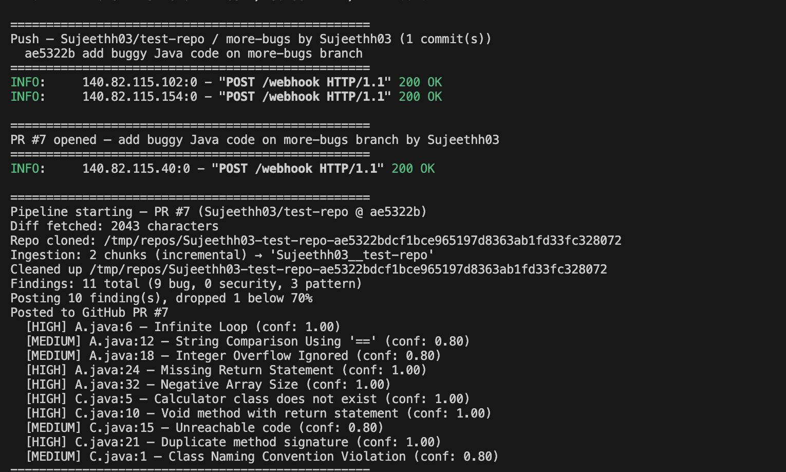
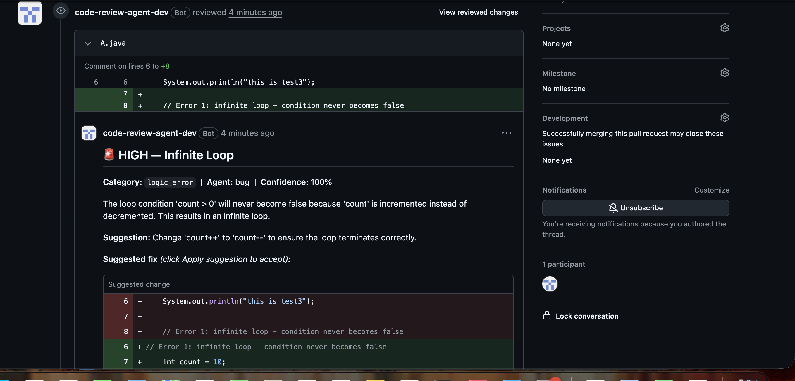
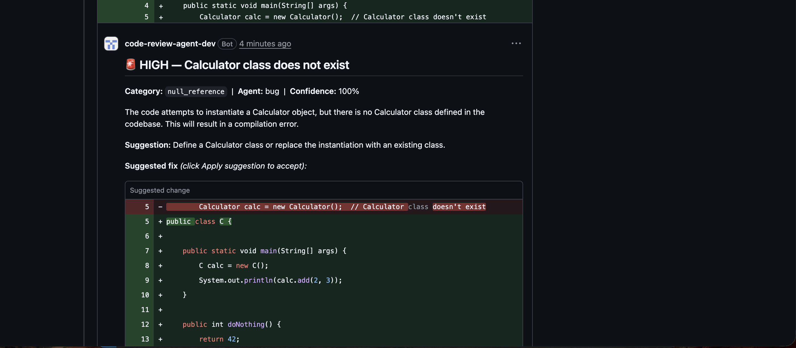

# PR Review Agent

An AI pipeline that reviews GitHub pull requests the moment they are opened or updated. Three specialist LLM agents run in parallel to detect bugs, security vulnerabilities, and convention violations, then post structured inline comments with fix suggestions directly on the diff.

---

## Demo

The agent posts inline review comments directly on the flagged lines within seconds of a PR being opened.

**Pipeline output** — 11 findings detected across two files, 10 posted after confidence filtering:



**Inline comment on the PR diff** — bug finding with one-click fix suggestion:





---

## How it works

```
GitHub PR opened / new commit pushed
             │
             ▼
     FastAPI webhook receiver
     (HMAC-SHA256 validated)
             │
             │  responds 200 immediately
             │  pipeline runs in background
             ▼
     Fetch PR diff  ──►  Clone repo at head SHA
                                  │
                                  ▼
                        Ingestion Agent
                        ┌─────────────────────────┐
                        │ tree-sitter chunking     │
                        │ OpenAI embeddings        │
                        │ ChromaDB vector store    │
                        └────────────┬────────────┘
                                     │ repo deleted after ingest
                                     ▼
              ┌──────────────────────┼──────────────────────┐
              │   LangGraph fan-out  │  (all three parallel) │
              ▼                      ▼                       ▼
      ┌──────────────┐    ┌──────────────────┐    ┌──────────────────┐
      │  Bug Agent   │    │ Security Agent   │    │  Pattern Agent   │
      │              │    │                  │    │                  │
      │ Null refs    │    │ OWASP Top 10     │    │ Compares diff    │
      │ Logic errors │    │ Hardcoded secrets│    │ against codebase │
      │ Resource     │    │ Injection flaws  │    │ conventions via  │
      │ leaks        │    │ Auth gaps        │    │ ChromaDB context │
      └──────┬───────┘    └────────┬─────────┘    └────────┬─────────┘
             └────────────────────┼──────────────────────┘
                                  │
                                  ▼
                    Deduplicate findings
                    (same line, keep highest confidence)
                                  │
                    filter: confidence ≥ 0.70
                                  │
                                  ▼
                        PR Writer Agent
                        ┌─────────────────────────┐
                        │ Clears stale bot comments│
                        │ GPT-4o generates fix     │
                        │ OWASP educational context│
                        │ GitHub suggestion block  │
                        └────────────┬────────────┘
                                     │
                                     ▼
                        Inline comment on PR diff
```

---

## What a posted comment looks like

Each finding becomes an inline review comment on the exact flagged line:

```
🚨 HIGH — Off-by-one error in array indexing

Category: `logic_error`  |  Agent: bug  |  Confidence: 80%

Accessing `arr[arr.length]` will throw an ArrayIndexOutOfBoundsException at runtime.
Java arrays are zero-indexed; the last valid index is `arr.length - 1`.

Suggestion: change the loop bound to `i < arr.length`

Suggested fix (click Apply suggestion to accept):

  for (int i = 0; i < arr.length; i++) {

---

### Why this matters
This issue can directly lead to incorrect behaviour or a crash if left unaddressed.
```

For security findings, the comment includes the relevant OWASP Top 10 category and a plain-English explanation of the real-world exploit path.

---

## Tech stack

| Layer | Technology |
|---|---|
| Webhook receiver | Python · FastAPI |
| Agent orchestration | LangGraph (parallel fan-out) |
| LLM | OpenAI GPT-4o — analysis + fix generation |
| Embeddings | OpenAI `text-embedding-3-small` |
| Vector store | ChromaDB |
| Code parsing | tree-sitter (Python, JS, TS, Java, Go, Rust, C, C++) |
| GitHub integration | GitHub App · JWT auth · PR Review API |

---

## Project structure

```
backend/
  main.py                          # FastAPI app — webhook receiver, background pipeline
  app/
    github_client.py               # GitHub App JWT auth, installation tokens, diff fetch
    repo_manager.py                # Shallow clone at PR head SHA
    agents/
      ingestion/                   # Walk → chunk → embed → ChromaDB upsert
      specialist/
        graph.py                   # LangGraph fan-out: bug + security + pattern in parallel
        bug/                       # Null refs, logic errors, resource leaks
        security/                  # OWASP Top 10, hardcoded secrets, auth gaps
        pattern/                   # Convention consistency vs ChromaDB codebase context
      pr_writer/                   # Format + post inline GitHub review comments
    models/
      findings.py                  # Finding, AgentOutput, SpecialistResult (Pydantic)
```

---

## Self-hosting

### 1. Create a GitHub App

Go to **GitHub → Settings → Developer settings → GitHub Apps → New GitHub App** and set:

| Field | Value |
|---|---|
| GitHub App name | anything (e.g. `my-review-agent`) |
| Homepage URL | your repo URL |
| Webhook URL | your server URL + `/webhook` (use [smee.io](https://smee.io) for local dev) |
| Webhook secret | generate a random string — you'll need it later |

**Repository permissions:**

| Permission | Access |
|---|---|
| Contents | Read |
| Pull requests | Read & Write |
| Metadata | Read (auto-selected) |

**Subscribe to events:**

- ✅ Pull request
- ✅ Push

Click **Create GitHub App**, then:
- Note the **App ID** shown at the top of the settings page
- Scroll down → **Generate a private key** → download the `.pem` file
- Install the app on the repos you want it to review

---

### 2. Get an OpenAI API key

Create one at [platform.openai.com/api-keys](https://platform.openai.com/api-keys). The agents use `gpt-4o` for analysis and `text-embedding-3-small` for embeddings.

---

### 3. Install and configure

```bash
git clone https://github.com/Sujeethh03/PR-review-Agent.git
cd PR-review-Agent/backend
python3 -m venv .venv && source .venv/bin/activate
pip install --index-url https://pypi.org/simple/ -r requirements.txt
```

Create `backend/.env`:

```env
GITHUB_APP_ID=your_app_id
GITHUB_WEBHOOK_SECRET=your_webhook_secret
GITHUB_PRIVATE_KEY_PATH=/path/to/your-private-key.pem
OPENAI_API_KEY=sk-...
```

---

### 4. Run

```bash
cd backend
uvicorn main:app --reload
```

For local development, tunnel webhooks from GitHub to your machine:

```bash
npx smee-client --url https://smee.io/YOUR_CHANNEL --target http://localhost:8000/webhook
```

Set the smee URL as the webhook URL in your GitHub App settings.

Open or push to a PR on any installed repo — the pipeline runs automatically in the background.

---

### 5. Test without a live PR

```bash
cd backend
python test_specialist.py   # runs all three agents on deliberate bugs
python test_ingestion.py    # tests ChromaDB ingestion in isolation
```

---

## Configuration

| Variable | Default | Description |
|---|---|---|
| `CONFIDENCE_THRESHOLD` | `0.70` | Minimum confidence to post a finding to GitHub. Raise to reduce noise, lower to catch more. |

Set in `main.py`. Findings below the threshold are silently dropped.

---

## Design decisions

**Why three separate agents instead of one?**
Each agent has a focused system prompt and a fixed set of categories it can report. A single agent asked to find everything tends to report fewer findings and conflate severity. Separation keeps each agent's context small and its output predictable.

**Why LangGraph for the fan-out?**
The three agents are fully independent — same input, no shared state. LangGraph's `StateGraph` with parallel edges from `__start__` gives clean fan-out/fan-in with async execution, so all three agents' API calls run concurrently rather than sequentially.

**Why ChromaDB for the pattern agent?**
The pattern agent's job is to compare new code against existing conventions. Without codebase context it would have nothing to compare against. ChromaDB lets it retrieve the most semantically similar functions from the same repo to use as a baseline.

**Why post directly instead of a human approval step?**
At the 0.70 confidence threshold, findings are specific enough to be worth surfacing without adding review friction. GitHub's own "Resolve conversation" and "Outdated" mechanisms handle dismissal and stale comment cleanup natively.
